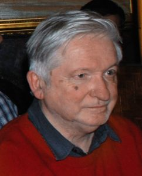
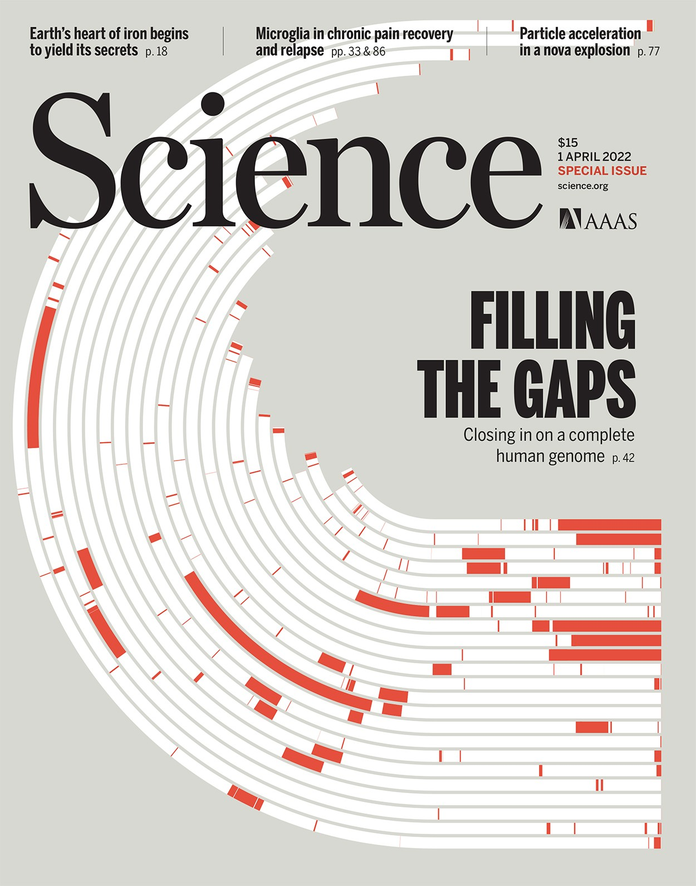
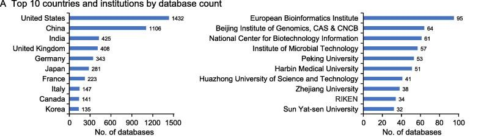
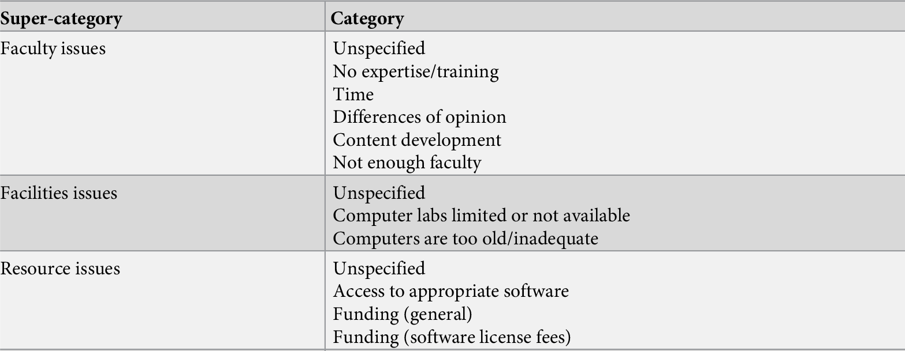
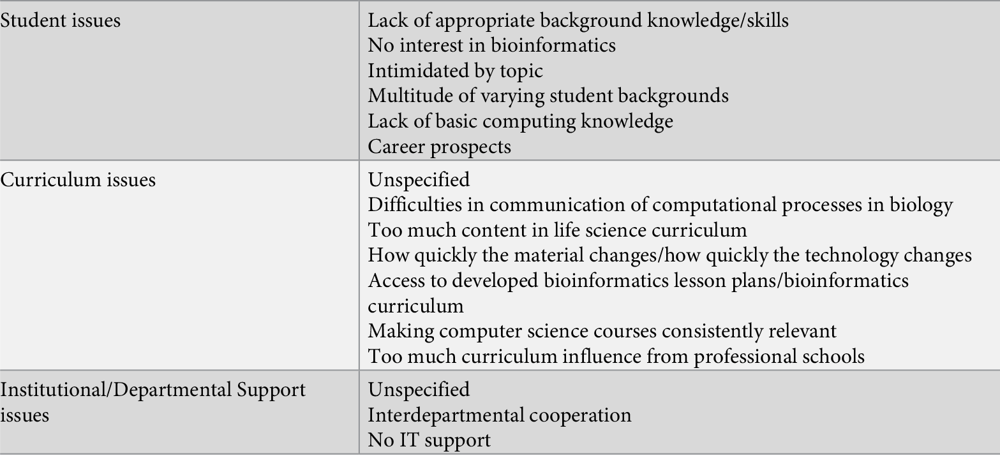
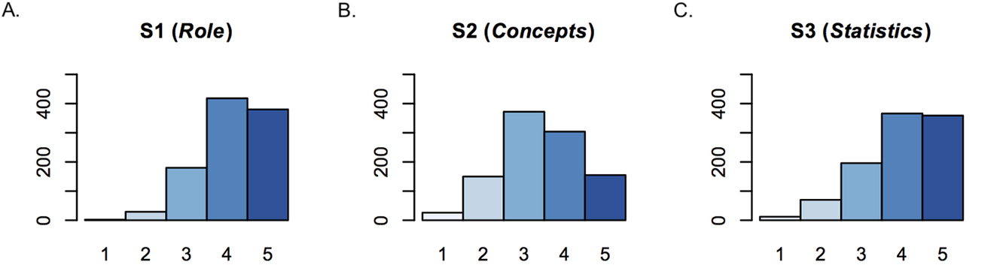
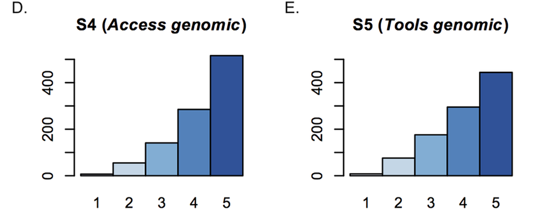
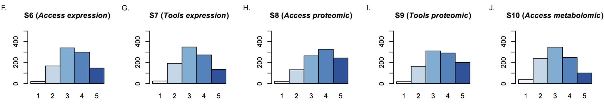
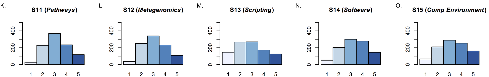
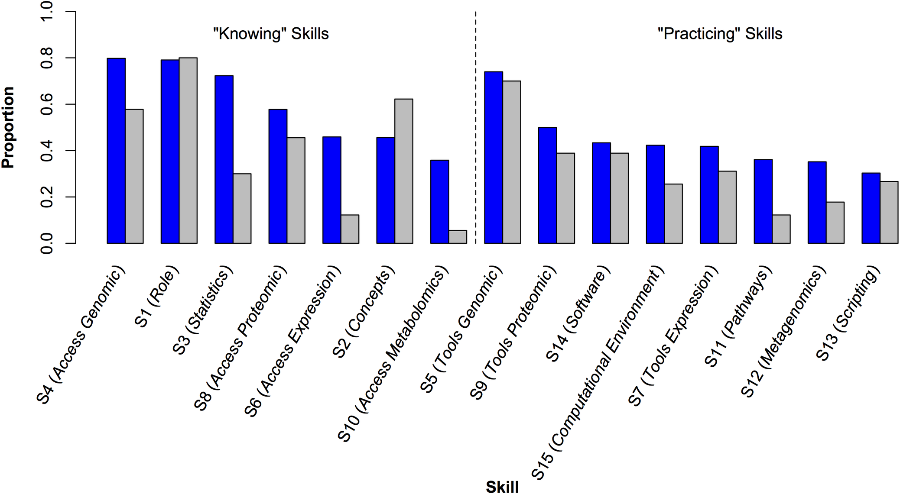

# Introduction to Bioinformatics

<h2 class="text-gray-500">Manish Datt</h2>

---
transition: fade-out
---

# What is Bioinformatics

  

  <figure>

<figcaption><a href="https://ubc.uu.nl/introduction-50-years-bioinformatics/">Paulien Hogeweg</a></figcaption>
</figure>

  

  <figure>

<figcaption><a href="https://ubc.uu.nl/introduction-50-years-bioinformatics/">Ben Hesper</a></figcaption>
</figure>

<h2> The study of informatic processes in biotic systems. </h2>

Life is information processing in its various forms, e.g., information accumulation during evolution, information transmission from DNA to intra- and intercellular processes, and the interpretation of such information at multiple levels. 

 Information processing could serve as a useful metaphor for understanding living systems. Therefore, in addition to biophysics and biochemistry, it was useful to distinguish bioinformatics as a research field.

---
transition: slide-left
---

# What is Bioinformatics

 

 

 Put simply, bioinformatics is the science of storing, retrieving and analyzing large amounts of biological information.

 

<a href="https://www.ebi.ac.uk/training/online/courses/bioinformatics-terrified/what-bioinformatics/">ebi.ac.uk</a>

<!--  -->

---
transition: fade-out
hide: true
---

# Central Dogma

<button class="border-2 border-blue-500 rounded-lg px-2" @click="showDiv('CD_DNA')">DNA</button> <carbon:arrow-right /> <button class="border-2 border-blue-500 rounded-lg px-2" @click="showDiv('CD_RNA')">RNA</button> <carbon:arrow-right /> <button class="border-2 border-blue-500 rounded-lg px-2" @click="showDiv('CD_PROTEIN')">Protein</button>

Genomics

Genome annotation, Comparative genomics, Genome-wide association studies

Transcriptomics

RNA-seq, DGE, ncRNA, RNA structure prediction, RNA design

Proteomics

functional annotation, structure prediction, PPI, PTMs,

sequencing, phylogenetics, metagenomics, epigenomics,

---
transition: fade-out
---

# Central Dogma

<button class="border-2 border-blue-600 rounded-lg px-2">DNA</button> <carbon:arrow-right /> <button class="border-2 border-cyan-600 rounded-lg px-2">RNA</button> <carbon:arrow-right /> <button class="border-2 border-green-600 rounded-lg px-2">Protein</button>

Genomics

Genome annotation, Comparative genomics, Genome-wide association studies

Transcriptomics

RNA-seq, DGE, ncRNA, RNA structure prediction, RNA design

Proteomics

functional annotation, structure prediction, PPI, PTMs,

Sequencing

Phylogenetics

Metagenomics, Epigenomics, ...

---
transition: fade-out
hide: true
---

# Why study Bioinformatics

For research

---
transition: slide-left
---

# Biological Databases

 

## Online libraries that contain structured information about living organisms.

Convenient, computable access to prior knowledge that is vital for planning future experiments and for discovering new knowledge through data mining. 

Databases can be of different types depending upon their information content.

---
transition: slide-left
---

# Biological Databases --- Nucleic Acid Research

<!-- ## 
Nucleic Acid Research --- Databases
  -->

<iframe src="https://www.oxfordjournals.org/nar/database/c/" width="800" height="400"></iframe>

---
transition: slide-left
---

# Biological Databases --- Development

<figure class="text-right text-sm">

<figurecaption><a href="https://academic.oup.com/gpb/article/21/5/1054/7632866">Database Commons</a></figurecaption>
</figure>

 

Ten Simple Rules for Developing Public Biological Databases. <a class="text-sm" href="https://doi.org/10.1371/journal.pcbi.1005128" target="_blank">PLOS One</a>

---
transition: slide-left
hide: true
---
# NGS

https://pmc.ncbi.nlm.nih.gov/articles/PMC4633438/pdf/40142_2015_Article_76.pdf

https://web.natur.cuni.cz/~muncling/Metzker%202010%20Next%20generation%20sequencing.pdf

<button bg="blue-400" p="y-2 x-4" rounded @click="greet">Greet</button> 

---
transition: slide-left
---
# NGS -- Illumina

<Youtube id="EDVKxSNdSic" width=600 height=400 />

---
transition: slide-left
---

# Bioinformatics Education 

Important challenges

<a href="https://journals.plos.org/plosone/article?id=10.1371/journal.pone.0224288">PLOS One, 2019</a>

---
transition: slide-left
---

# Bioinformatics Education 

<a href="https://journals.plos.org/plosone/article?id=10.1371/journal.pone.0224288">PLOS One, 2019</a>

---
transition: slide-left
---

# Bioinformatics Skills

 S1 (Role) — Understand the role of computation and data mining in hypothesis-driven processes within the life sciences 

 S2 (Concepts) — Understand computational concepts used in bioinformatics, e.g., meaning of algorithm, bioinformatics file formats 

 S3 (Statistics) — Know statistical concepts used in bioinformatics, e.g., E-value, z-scores, t test, type-1 error, type-2 error, employ R 

<a href="https://journals.plos.org/plosone/article?id=10.1371/journal.pone.0196878">PLOS One, 2018</a>

---
transition: slide-left
---

# Bioinformatics Skills

S4, S6, S8, S10 — Know how to access relevant data.

S5, S7, S9 — Be able to use bioinformatics tools to analyze relevant data.

<a href="https://journals.plos.org/plosone/article?id=10.1371/journal.pone.0196878">PLOS One, 2018</a>

---
transition: slide-left
---

# Bioinformatics Skills

S11—Be able to use bioinformatics tools to examine the flow of molecules within pathways/networks, e.g., Gene Ontology, KEGG

S12—Be able to use bioinformatics tools to examine metagenomics data, e.g., MEGA, MUSCLE

S13—Know how to write short computer programs as part of the scientific discovery process, e.g., write a script to analyze sequence data

S14—Be able to use software packages to manipulate and analyze bioinformatics data, e.g., Geneious, Vector NTI Express, spreadsheets

S15—Operate in a variety of computational environments e.g., Mac OS, Windows, web- or cloud-based, Linux command line

<a href="https://journals.plos.org/plosone/article?id=10.1371/journal.pone.0196878">PLOS One, 2018</a>

---
transition: slide-left
---

# Bioinformatics Skills

<a href="https://journals.plos.org/plosone/article?id=10.1371/journal.pone.0196878">PLOS One, 2018</a>

---
transition: slide-left
---

# Bioinformatics -- Programming

  

  

  

A high-level, object-oriented programming language.

  

A language and environment for statistical computing and graphics.

  

Libraries like Biopython for Bioinformatics analysis.

  

Packages like Bioconductor for bioinformatics analysis.

  

Ebook:&nbsp; <a href="https://pythonbook.bioinfo.guru" target="_blank"> pythonbook.bioinfo.guru</a>

  

Ebook: &nbsp; <a href="https://rbook.bioinfo.guru" target="_blank"> rbook.bioinfo.guru</a>

---
transition: slide-left
---

# What is Bioinformatics

 

 

It is a highly interdisciplinary field involving many different types of specialists, including biologists, molecular life scientists, computer scientists and mathematicians.

 

<a href="https://www.ebi.ac.uk/training/online/courses/bioinformatics-terrified/what-bioinformatics/">ebi.ac.uk</a>

---
transition: slide-left
layout: statement
---

# Thank you!

manish@bioinfo.guru

